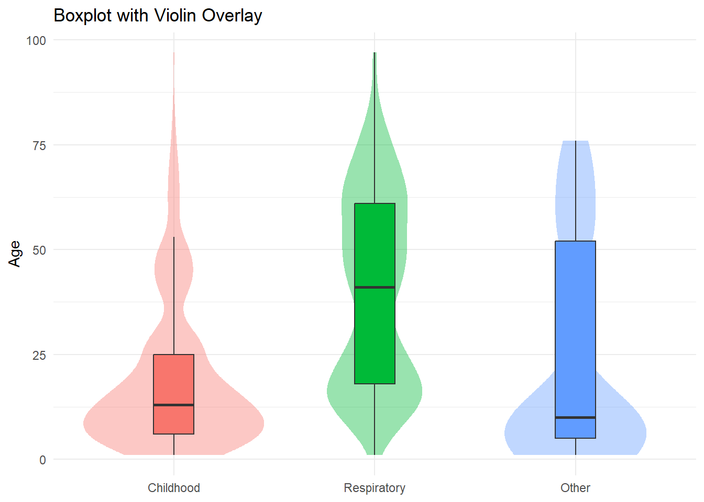

# 📊 Comprehensive Data Manipulation and Wrangling via R

**Live Website:** [http://habtamubizuayehu.com/Data_Manipulation_and_Wrangling_via_R/](http://habtamubizuayehu.com/Data_Manipulation_and_Wrangling_via_R/)  
**Full Guide:** [`Data manipulation Guide.html`](https://github.com/HabtamuBizuayehu/Data_Manipulation_and_Wrangling_via_R/blob/main/docs/Data%20manipulation%20Guide.html)

  

> A practical and comprehensive walkthrough of **data wrangling in R**, designed to build technical proficiency and confidence in cleaning, transforming, and analyzing data.  
> Author: [Habtamu Bizuayehu](https://habtamubizuayehu.com/) · [ORCID](https://orcid.org/0000-0002-1360-4909)

---

## 📌 Project Overview

This project introduces a step-by-step framework for **data manipulation and wrangling in R**, starting from foundational setup and syntax through to advanced integration, visualization, and automation.

### Key Features:
- **Part I:** Foundations — Installing R/RStudio, working directories, object types, Quarto & R Markdown.  
- **Part II:** Data Loading & Exploration — Importing and exploring CSV/Excel datasets.  
- **Part III:** Wrangling with `dplyr` — Selecting, renaming, creating, reshaping, grouping, and summarizing data.  
- **Part IV:** Advanced Wrangling — Handling dates, deduplication, merging datasets, missing data imputation.  
- **Part V:** Descriptive Statistics & Tables — Summaries, frequencies, cross-tabulations, exports.  
- **Part VI:** Visualization with `ggplot2` — Core chart types, multivariate plots, overlays, geospatial maps, themes.  
- **Part VII:** Shiny Apps — Interactive dashboards with reactive inputs, DT tables, and deployment.  
- **Case Studies:** Real-world examples using public health datasets.

👉 Explore the **Full Guide** here: [`Data manipulation Guide.html`](https://github.com/HabtamuBizuayehu/Data_Manipulation_and_Wrangling_via_R/blob/main/docs/Data%20manipulation%20Guide.html)

---

## 🖼️ Preview of Figures

### 1. Time Trends – Area Chart  

### 2. Distribution Comparisons – Violin Plot  

### 3. Categorical Comparison – Bar Plot  

### 4. Grouped Comparison – Column Plot  

### 5. Age Distribution – Histogram  

### 6. Hierarchical Data – Treemap  

---

## 🏷 Tags / Keywords

#R #DataWrangling #Tidyverse #dplyr #ggplot2 #Shiny #DataScience #DataAnalytics  
#PublicHealthData #RStats #ReproducibleResearch #Quarto #DataTransformation #OpenScience
